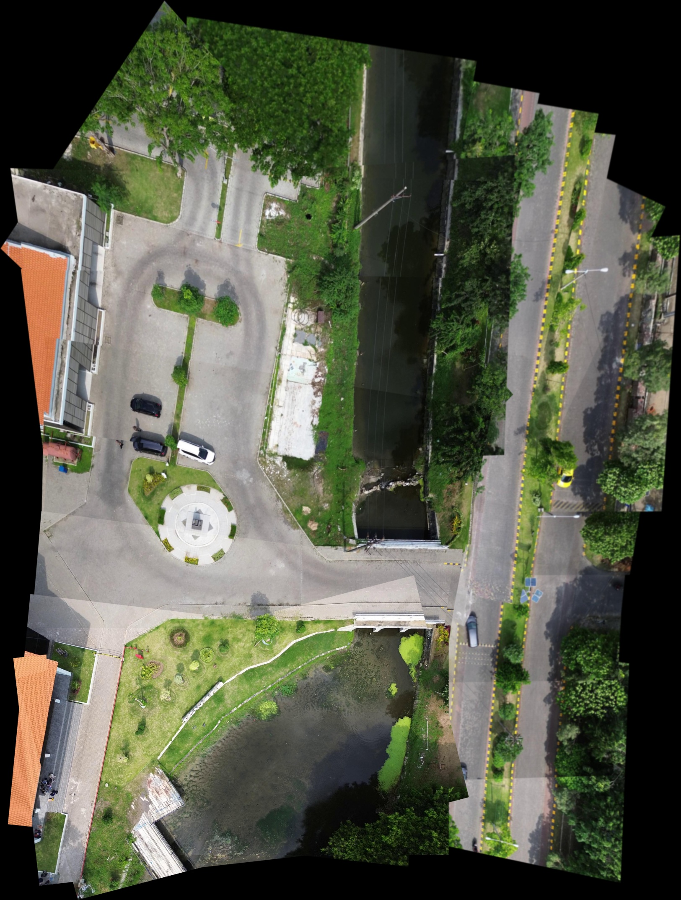

# 🔍 Feature Extraction & Image Mapping with ORB, SIFT, and AKAZE

This project demonstrates the process of **feature extraction** and **image stitching** using three different computer vision techniques:

- **ORB (Oriented FAST and Rotated BRIEF)**
- **SIFT (Scale-Invariant Feature Transform)**
- **AKAZE (Accelerated-KAZE)**

## 🧠 Feature Extraction

Each algorithm detects key features (keypoints) from the input images and visualizes them using **black dots** on the image. This is useful to compare how each algorithm perceives the unique points in the image.

### ORB Example

  
**Total Features: 500**

### SIFT Example

  
**Total Features: 9380**

### AKAZE Example

  
**Total Features: 3510**


> All three detectors identify different sets of keypoints depending on their underlying detection logic and matching method.

---

## 🗺️ Image Mapping / Stitching

We also demonstrate basic image stitching (panorama creation) using the matched keypoints between images. This includes:

- Feature matching (BFMatcher or FLANN)
- Homography estimation (using RANSAC)
- Warping and combining images

### ORB Stitching



### SIFT Stitching


### AKAZE Stitching


---

## 🧪 Requirements

```bash
pip install opencv-python
```

If using SIFT (part of OpenCV-contrib), install:

```bash
pip install opencv-contrib-python
```

---

## ▶️ Run the Feature Extraction

```bash
python feature_extraction_orb.py
python feature_extraction_sift.py
python feature_extraction_akaze.py
```

## ▶️ Run the Image Stitching

```bash
python stitching_orb.py
python stitching_sift.py
python stitching_akaze.py
```

---

## 📌 Notes

- AKAZE only works with `cv2.BFMatcher` and `cv2.NORM_HAMMING`.
- SIFT and ORB can be used with `cv2.BFMatcher` or `cv2.FlannBasedMatcher`.
- Resize input images if you encounter memory issues during warping.

---
